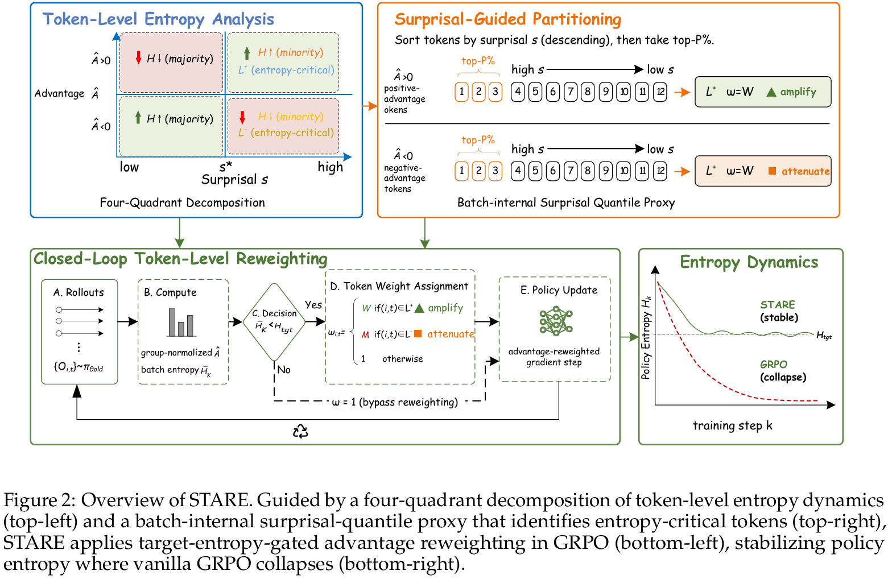
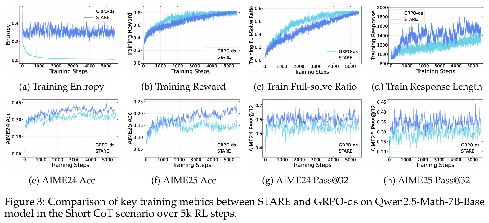
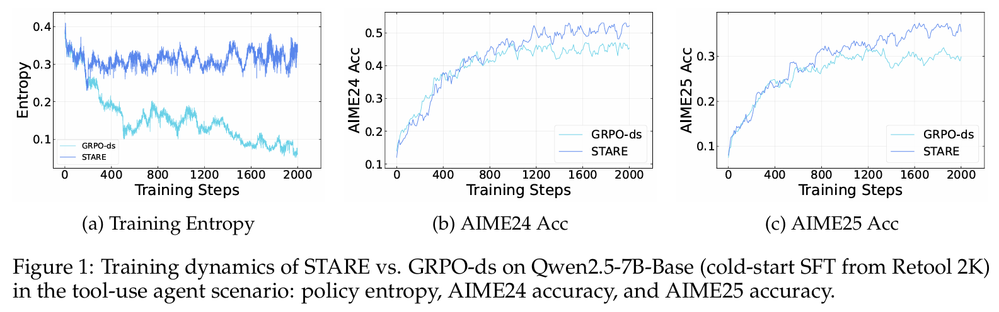
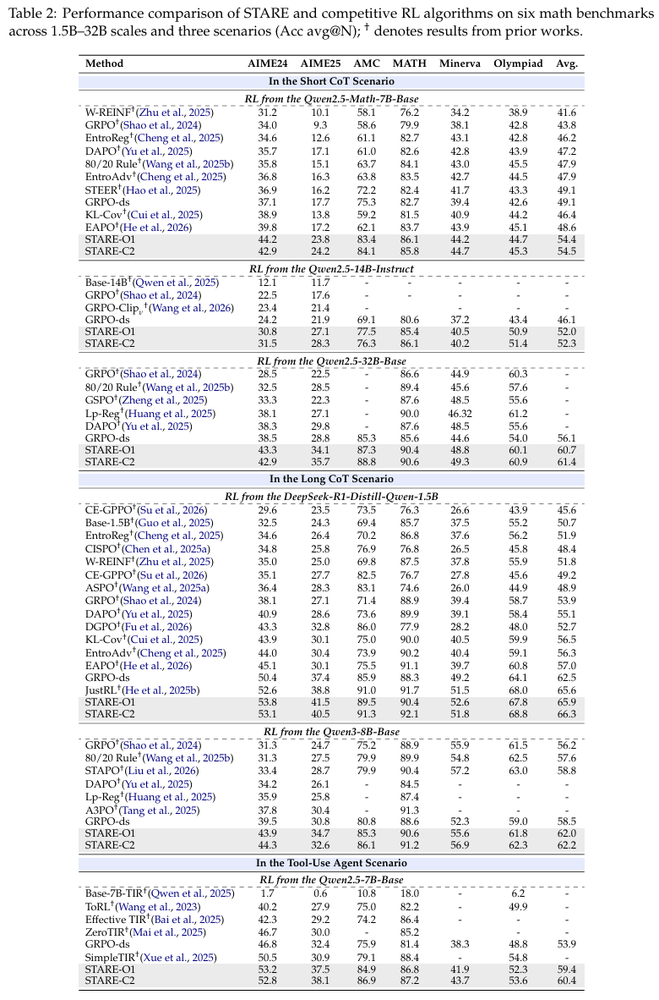

<h1 style="text-align: center;">STARE: Surprisal-Guided Token-Level Advantage Reweighting for Policy Entropy Stability</h1>

<br>

<div align="center">
&nbsp;&nbsp;&nbsp;&nbsp;&nbsp;&nbsp;&nbsp;&nbsp;

</div>

<div align="center">

<p><em><b>Figure 1: Overview of STARE.</b> Guided by a four-quadrant decomposition of token-level entropy dynamics (top-left) and a batch-internal surprisal-quantile proxy that identifies entropy-critical tokens (top-right), STARE applies target-entropy-gated advantage reweighting in GRPO (bottom-left), stabilizing policy entropy where vanilla GRPO collapses (bottom-right).</em></p>
</div>

---

## Overview

Reinforcement Learning with Verifiable Rewards (RLVR) algorithms such as GRPO have emerged as the dominant post-training paradigm for complex reasoning in LLMs, yet commonly suffer from **policy entropy collapse** during training. We conduct a first-order gradient analysis of token-level entropy dynamics under GRPO and identify a **token-level credit assignment mismatch**: the per-token entropy variation decomposes into the product of the trajectory-level advantage and an entropy sensitivity function over the next-token distribution, yielding an **advantage–surprisal four-quadrant structure** and a **near-criticality property**.

Building on this analysis, we propose **STARE** (Surprisal-guided Token-level Advantage Reweighting for policy Entropy stability):

- **Entropy-Critical Token Identification**: Locating entropy-critical token subsets via batch-internal surprisal quantiles
- **Selective Advantage Reweighting**: Selectively amplifying the effective advantage of positive-advantage high-surprisal tokens (L+) to sustain exploration
- **Closed-Loop Target-Entropy Gating**: Activating intervention only when batch mean entropy falls below target entropy H_tgt; reverting to standard GRPO when above the threshold, achieving stable entropy regulation

Below we illustrate the RL training dynamics on two representative scenarios: Qwen2.5-7B Short CoT and Multi-Turn Tool-Use Agent.

<div align="center">

<p><em><b>Figure 2: Training dynamics (Qwen2.5-7B Short CoT).</b></em></p>
</div>

<div align="center">

<p><em><b>Figure 3: Training dynamics (Multi-Turn Tool Use Agent).</b></em></p>
</div>

---

## Installation

This codebase is built on [verl v0.7.0](https://github.com/verl-project/verl/tree/v0.7.0). We recommend using the official Docker image:

```bash
docker pull verlai/verl:vllm011.latest
```

Alternatively, refer to the [verl installation guide](https://verl.readthedocs.io/en/latest/start/install.html) for manual environment setup.

---

## Datasets

### Training Set

We recommend mixing and deduplicating the following open-source datasets: [DeepScaleR](https://huggingface.co/datasets/agentica-org/DeepScaleR-Preview-Dataset), [Skywork-OR1](https://huggingface.co/datasets/Skywork/Skywork-OR1-RL-Data), [Polaris](https://huggingface.co/datasets/POLARIS-Project/Polaris-Dataset-53K), [DAPO-Math-17k](https://huggingface.co/datasets/BytedTsinghua-SIA/DAPO-Math-17k)

**Quick Start** (using DAPO-Math-17k as an example):

```bash
python recipe/STARE/datasets/dapo_17k_text_train.py
```

Output is saved to `recipe/STARE/datasets/train/dapo_17k_text_train.parquet`, which the training scripts use by default.

### Evaluation Set

We evaluate on 6 math benchmarks, stored in `recipe/STARE/datasets/eval/`:
- **avg@32**: AIME24, AIME25, AMC23
- **avg@4**: MATH-500, MinervaMath, OlympiadBench

The training scripts evaluate on AIME24 and AIME25 by default. Modify the `test_files` variable to include additional benchmarks.

---

## Base Models

We use [Qwen series](https://huggingface.co/Qwen/collections) models. Download example:

```bash
huggingface-cli download Qwen/Qwen2.5-Math-7B \
    --local-dir /root/model_path/Qwen2.5-Math-7B \
    --resume-download
```

---

## Training

The training pipeline fully inherits the standard GRPO framework; enabling STARE only requires toggling a configuration switch.

### GRPO-ds Baseline (stare_enabled=False)

```bash
bash recipe/STARE/scripts/run_short_cot_qwen2.5_math_7b_GRPO_ds.sh
```

### STARE (Proposed Method)

```bash
bash recipe/STARE/scripts/run_short_cot_qwen2.5_math_7b_STARE.sh
```

> Please modify `MODEL_PATH` and `CKPTS_DIR` in the scripts before running.

### STARE Core Hyperparameters

Default configuration (7B): `stare_enabled=True`, `stare_variant=O1`, `stare_top_p_ratio=0.1`, `stare_reweight_w=1.1`, `stare_reweight_m=0.9`, `stare_target_entropy=0.3`.

For **14B/32B** models, we recommend milder reweighting: `stare_reweight_w=1.05`, `stare_reweight_m=0.95`, and correspondingly increasing `max_response_length`.

Variant descriptions:
- **O1** (default): One-sided entropy amplification — applies W > 1 weight only to L+ (positive-advantage high-surprisal tokens), amplifying entropy-increasing signals
- **C2**: Two-sided regulation — additionally applies M < 1 attenuation to L- (negative-advantage high-surprisal tokens), simultaneously reducing entropy-decreasing pressure

### Distributed Training

Training scripts default to 2 nodes × 8 GPUs. Launch procedure:

```bash
# Head node
ray start --head --node-ip-address <HEAD_NODE_IP> --num-gpus 8

# Worker node
ray start --address <HEAD_NODE_IP>:6379 --num-gpus 8
```

Submit the training job:

```bash
ray job submit --address="http://127.0.0.1:8265" \
  --runtime-env-json='{"env_vars": {
    "TOKENIZERS_PARALLELISM": "true",
    "NCCL_DEBUG": "WARN",
    "VLLM_LOGGING_LEVEL": "WARN",
    "VLLM_ALLOW_RUNTIME_LORA_UPDATING": "true",
    "CUDA_DEVICE_MAX_CONNECTIONS": "1",
    "RAY_DEBUG": "legacy",
    "VLLM_USE_V1": "1"
  }}' \
  -- bash recipe/STARE/scripts/run_short_cot_qwen2.5_math_7b_STARE.sh \
  2>&1 | tee -a /root/verl_logs/run_stare.log
```

For more details on distributed training, see the [verl documentation](https://verl.readthedocs.io/en/latest/start/install.html).

---

## Core Implementation

The core STARE algorithm is implemented in `verl/trainer/ppo/core_algos.py` (L1070–1293), and the closed-loop controller resides in `recipe/STARE/stare_ray_trainer.py`.

**Algorithm Pipeline:**

```
Input:  token log-probs, trajectory-level advantage Â, response mask
Output: token-level reweighting factor ω

1. Partition by advantage sign: T+ = {Â > 0}, T- = {Â < 0}
2. Within each subset, rank tokens by surprisal s = -ln π(o) in descending order,
   select Top-P% to form entropy-critical sets L+ (and L-)
3. Closed-loop gating: gate = 𝟙[H̄_batch < H_tgt]
4. Reweighting:
     ω = W,  if (i,t) ∈ L+          (amplify entropy-increasing signal)
     ω = M,  if (i,t) ∈ L-  [C2]   (attenuate entropy-decreasing signal)
     ω = 1,  otherwise
5. STARE objective: J_STARE = (1/N) Σ ω_i,t · min(ρ_i,t · Â_i, clip(ρ_i,t, 1-ε, 1+ε) · Â_i)
```

Setting ω ≡ 1 recovers standard GRPO. Because ω > 0, STARE preserves all token-level gradient directions: tokens with positive advantage remain reinforced, while those with negative advantage remain suppressed.

---

## Key Results

Across model scales from 1.5B to 32B and three task families (Short CoT, Long CoT, and Multi-Turn Tool Use), STARE sustains stable RL training over thousands of steps while maintaining policy entropy within the target band. On AIME24 and AIME25, STARE outperforms DAPO and other competitive baselines by **4%–8%** in average accuracy, with reflection tokens and response length growing in tandem, indicating sustained exploration–exploitation balance.

<div align="center">

<p><em><b>Table 1: Main experimental results.</b> Performance comparison across 1.5B–32B scales and three scenarios.</em></p>
</div>

---

## Acknowledgments

We thank the [verl](https://github.com/verl-project/verl) distributed RL framework, [Qwen](https://huggingface.co/Qwen) open-source models, and [DAPO](https://arxiv.org/abs/2503.14476), [DeepScaleR](https://huggingface.co/datasets/agentica-org/DeepScaleR-Preview-Dataset), [Skywork-OR1](https://huggingface.co/datasets/Skywork/Skywork-OR1-RL-Data), [Polaris](https://huggingface.co/datasets/POLARIS-Project/Polaris-Dataset-53K) for their open-source data. All competitive baselines can be easily reproduced within verl.
